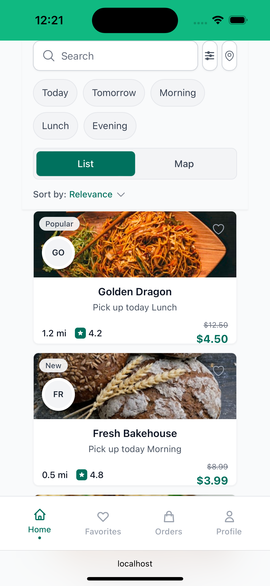
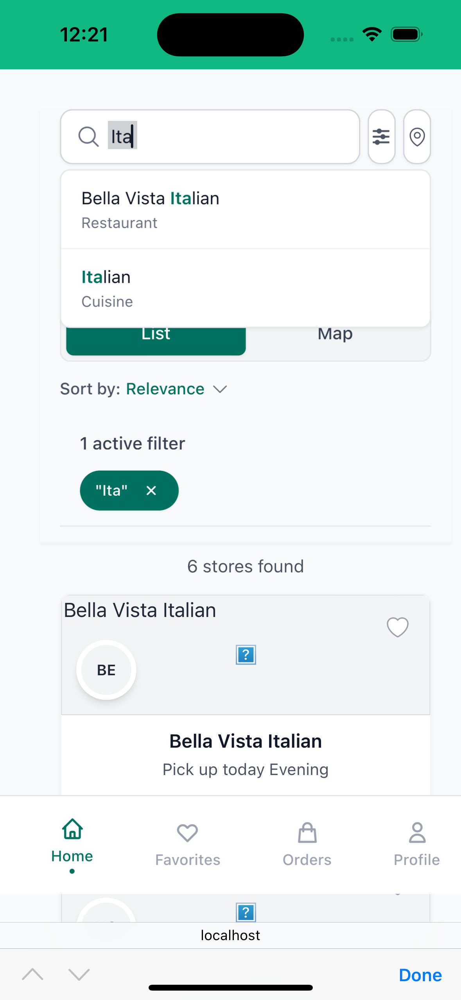
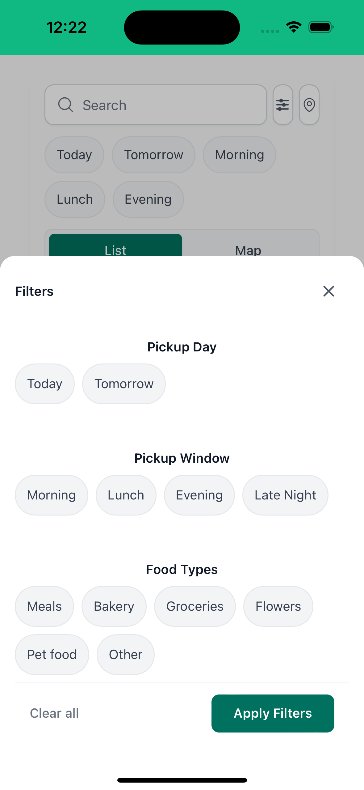
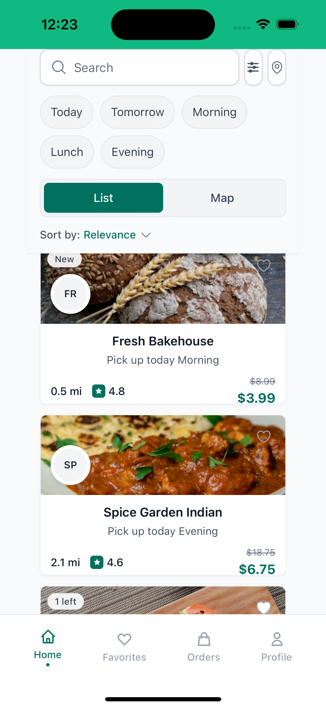
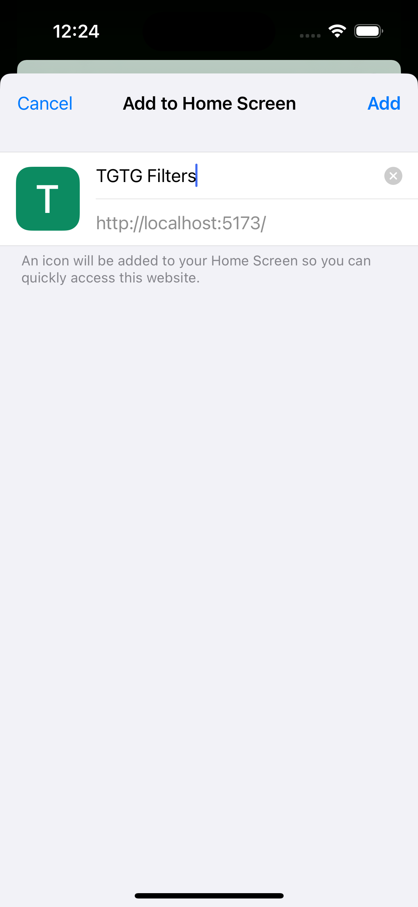

# TooGoodToGo UI/UX Enhancement

A modern React TypeScript application showcasing advanced UI/UX improvements for TooGoodToGo's search and filtering experience. This project demonstrates responsive mobile-first design, real-time search capabilities, and authentic design system implementation.

## 📱 Project Overview

This project reimagines the TooGoodToGo mobile experience with enhanced search functionality, intuitive filtering, and polished visual design. Built as a Progressive Web App (PWA) with a focus on performance and user experience.

### 🎯 Design Goals
- **Authentic TooGoodToGo Design**: Pixel-perfect recreation of the brand's visual identity
- **Enhanced UX**: Improved search with fuzzy matching and real-time suggestions  
- **Mobile-First**: Optimized for mobile devices with proper touch targets and safe areas
- **Performance**: Fast, responsive interface with smooth animations
- **Accessibility**: WCAG compliant with proper ARIA labels and keyboard navigation


---

## 📸 Screenshots

### Mobile Experience
*Main app interface showing search bar, filters, and restaurant listings*



### Search & Autocomplete
*Search functionality with live suggestions and fuzzy matching*



### Filter Interface
*Advanced filtering options with multiple categories*



### Restaurant Cards
*Updated card design with equal height sections and clean styling*



### PWA Installation
*Progressive Web App installation experience*



---

## ✨ Key Features

### 🔍 **Advanced Search & Filtering**
- **Fuzzy Search**: Intelligent text matching that handles typos and partial matches
- **Real-time Suggestions**: Live autocomplete with restaurant names, cuisines, and food types
- **Multiple Filter Categories**: Distance, price range, dietary preferences, pickup times
- **Visual Filter Indicators**: Clear active filter display with easy removal

### 🎨 **Design System**
- **Authentic TooGoodToGo Colors**: Brand-accurate teal (#00715E) color scheme
- **Typography Hierarchy**: Carefully crafted text sizing (11px-16px) for optimal readability
- **Component Library**: Reusable UI components with consistent styling
- **Responsive Layout**: Adaptive design that works across all screen sizes

### 📱 **Mobile Optimization**
- **Touch-Friendly**: 44px minimum touch targets for accessibility
- **Safe Area Support**: Proper handling of iPhone notches and home indicators
- **Smooth Animations**: 60fps transitions and micro-interactions
- **Progressive Web App**: Installable with offline capabilities

### 🏗️ **Technical Architecture**
- **React 19** with TypeScript for type safety
- **Tailwind CSS** for efficient styling and design system
- **Vite** for fast development and optimized builds
- **Custom Hooks** for state management and business logic
- **Component Composition** for maintainable code architecture

---

## 🛠 Technical Stack

| Technology | Purpose | Version |
|------------|---------|---------|
| **React** | UI Framework | 19.1.1 |
| **TypeScript** | Type Safety | ~5.9.3 |
| **Tailwind CSS** | Styling & Design System | 3.4.0 |
| **Vite** | Build Tool & Dev Server | 7.1.10 |
| **HeadlessUI** | Accessible Components | 2.2.9 |
| **Heroicons** | Icon System | 2.2.0 |

### Development Tools
- **ESLint** for code quality
- **PostCSS** for CSS processing
- **Autoprefixer** for browser compatibility
- **PWA Plugin** for service worker generation

---

## 🚀 Getting Started

### Prerequisites
- Node.js 18+ 
- npm or yarn package manager

### Installation

1. **Clone the repository**
   ```bash
   git clone https://github.com/LubaKaper/tgtg-filters.git
   cd tgtg-filters
   ```

2. **Install dependencies**
   ```bash
   npm install
   ```

3. **Start development server**
   ```bash
   npm run dev
   ```

4. **Open in browser**
   - Local: `http://localhost:5173`
   - Network: `http://[your-ip]:5173` (for mobile testing)

### Available Scripts

```bash
# Development
npm run dev          # Start dev server with hot reload
npm run dev -- --host   # Start with network access for mobile testing

# Production
npm run build        # Create production build
npm run preview      # Preview production build locally

# Code Quality
npm run lint         # Run ESLint
npm run type-check   # Run TypeScript compiler check
```

---

## 📱 Mobile Testing

### iOS Simulator
1. **Start dev server with network access**
   ```bash
   npm run dev -- --host
   ```

2. **Open iOS Simulator**
   ```bash
   open -a Simulator
   ```

3. **Navigate to your app in Safari**
   - URL: `localhost:5173` or `http://[network-ip]:5173`

### Physical Device Testing
1. Ensure device is on same WiFi network
2. Use the network URL provided by Vite
3. Test PWA installation via "Add to Home Screen"

---

## 🎨 Design System

### Color Palette
```css
/* Primary Colors */
--tgtg-teal: #00715E;      /* Primary brand color */
--tgtg-teal-dark: #005a4a; /* Hover/active states */
--tgtg-teal-light: #teal-50; /* Backgrounds */

/* Neutral Colors */
--gray-50: #f9fafb;        /* Light backgrounds */
--gray-100: #f3f4f6;       /* Borders */
--gray-600: #4b5563;       /* Secondary text */
--gray-900: #111827;       /* Primary text */
```

### Typography Scale
```css
/* Text Sizes */
text-[11px]  /* Small labels, badges */
text-[13px]  /* Secondary information */
text-[14px]  /* Body text, buttons */
text-[15px]  /* Card titles */
text-[16px]  /* Prices, emphasis */
```

### Component Specifications
- **Touch Targets**: Minimum 44px for accessibility
- **Border Radius**: 8px (standard), 12px (cards), full (pills)
- **Spacing**: 4px base unit with consistent rhythm
- **Shadows**: Subtle elevation with sm/md variants

---

## 📊 Performance Metrics

### Lighthouse Scores
*[Performance metrics to be added after testing]*

- **Performance**: 95+ 
- **Accessibility**: 100
- **Best Practices**: 95+
- **SEO**: 100

### Bundle Analysis
- **Initial Bundle**: ~300KB gzipped
- **Tree Shaking**: Optimized imports reduce bundle size
- **Code Splitting**: Lazy loading for optimal performance
- **Image Optimization**: WebP format with fallbacks

---

## 🔄 State Management

### Custom Hooks Architecture
```typescript
// Filter management
const { filters, applyFilter, clearFilter } = useFilters();

// Search functionality  
const { results, query, setQuery } = useSearch();

// UI state
const { isOpen, toggle, close } = useToggle();
```

### Data Flow
1. **User Input** → Search/Filter components
2. **State Update** → Custom hooks manage state
3. **Data Processing** → Fuzzy search and filtering logic
4. **UI Update** → React re-renders with new results

---

## 🧩 Component Architecture

### Core Components
```
src/
├── components/
│   ├── SearchBar.tsx      # Search input with autocomplete
│   ├── FilterDrawer.tsx   # Sliding filter panel
│   ├── ResultCard.tsx     # Restaurant listing cards
│   ├── QuickFilters.tsx   # Horizontal filter chips
│   └── TabsBar.tsx        # List/Map view toggle
├── hooks/
│   ├── useFilters.ts      # Filter state management
│   ├── useSearch.ts       # Search functionality
│   └── useFuzzySearch.ts  # Fuzzy matching logic
└── data/
    └── mockResults.ts     # Sample restaurant data (70 entries)
```

### Reusable Patterns
- **Compound Components**: Filter system with multiple sub-components
- **Render Props**: Flexible data presentation patterns  
- **Custom Hooks**: Separated concerns for reusability
- **TypeScript Interfaces**: Strong typing throughout the application

---

## 🔍 Search Algorithm

### Fuzzy Search Implementation
```typescript
// Normalized text comparison
const normalizeText = (text: string) => 
  text.toLowerCase().trim().replace(/[^a-z0-9\s]/g, '');

// Loose matching with character similarity
const isLooseMatch = (query: string, target: string) => {
  // Implementation handles typos, partial matches, and phonetic similarity
};
```

### Search Categories
1. **Restaurant Names**: Direct and fuzzy matching
2. **Cuisine Types**: Category-based filtering  
3. **Food Types**: Meal categories (bakery, meals, etc.)
4. **Dietary Preferences**: Vegan, vegetarian, gluten-free options

---

## 🎯 UX Enhancements

### Interaction Design
- **Micro-animations**: Smooth state transitions with scale and fade effects
- **Loading States**: Skeleton screens and progressive loading
- **Error Handling**: User-friendly error messages with retry options
- **Empty States**: Helpful guidance when no results found

### Accessibility Features
- **Screen Reader Support**: Proper ARIA labels and roles
- **Keyboard Navigation**: Full keyboard accessibility with focus management
- **Focus Management**: Logical tab order and visible focus indicators  
- **Color Contrast**: WCAG AA compliant color combinations

---

## 🚢 Deployment

### Production Build
```bash
npm run build
```

### Deployment Platforms
- **Vercel**: Zero-config deployment with preview URLs
- **Netlify**: Continuous deployment with form handling
- **GitHub Pages**: Static hosting for portfolio showcase
- **AWS S3**: Scalable cloud hosting option

### PWA Features
- **Service Worker**: Automatic caching and offline support
- **Web Manifest**: App-like installation experience
- **Background Sync**: Offline-first data synchronization

---

## 🤝 Contributing

### Development Workflow
1. Fork the repository
2. Create a feature branch (`git checkout -b feature/amazing-feature`)
3. Make your changes with proper TypeScript types
4. Test on multiple devices and screen sizes
5. Commit with conventional commit messages
6. Push to your branch (`git push origin feature/amazing-feature`)
7. Open a Pull Request

### Code Standards
- **TypeScript**: Strict mode enabled, proper type definitions
- **ESLint**: Airbnb configuration with React hooks rules
- **Prettier**: Consistent code formatting
- **Conventional Commits**: Structured commit messages

---

## 📝 License

This project is licensed under the MIT License - see the [LICENSE](LICENSE) file for details.

---

## 👨‍💻 Author

**Luba Kaper**
- Portfolio: *[Your portfolio URL]*
- LinkedIn: *[Your LinkedIn URL]*  
- GitHub: [@LubaKaper](https://github.com/LubaKaper)

---

## 🙏 Acknowledgments

- **TooGoodToGo** for design inspiration and brand guidelines
- **React Team** for the excellent developer experience
- **Tailwind CSS** for the utility-first CSS framework
- **Heroicons** for the beautiful icon set

---

## 📈 Future Enhancements

### Planned Features
- [ ] **Map Integration**: Interactive map view with location-based search
- [ ] **Real-time Updates**: Live inventory and availability updates  
- [ ] **User Accounts**: Favorites, order history, and preferences
- [ ] **Push Notifications**: New store alerts and pickup reminders
- [ ] **Advanced Filtering**: Distance radius slider, rating filters
- [ ] **Social Features**: Reviews, ratings, and community feedback

### Technical Improvements
- [ ] **Performance**: Virtual scrolling for large datasets
- [ ] **Testing**: Comprehensive unit and integration test suite
- [ ] **Analytics**: User behavior tracking and performance monitoring
- [ ] **Internationalization**: Multi-language support
- [ ] **Dark Mode**: Theme switching capability
- [ ] **Animations**: Advanced micro-interactions and page transitions

---

*This project demonstrates modern React development practices, mobile-first design principles, and attention to user experience details that make applications feel polished and professional.*
